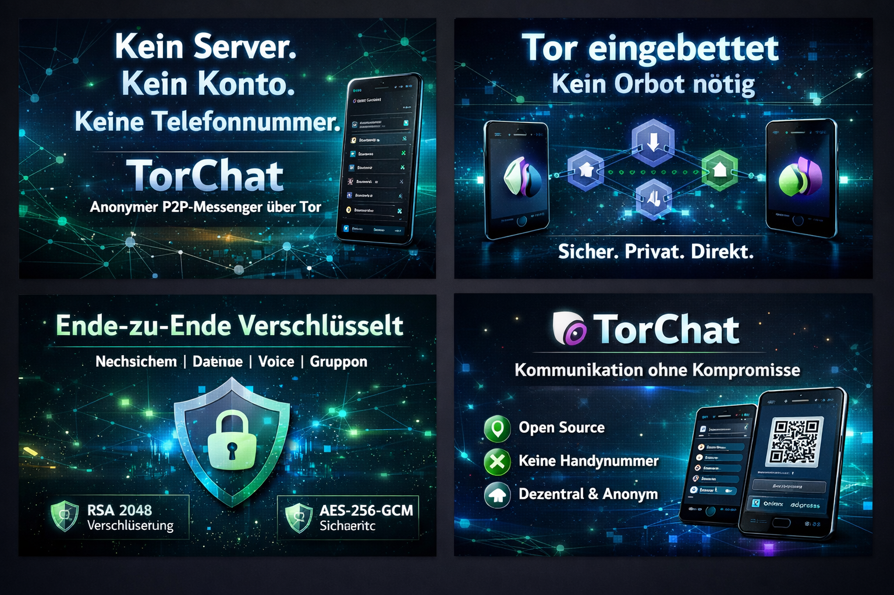
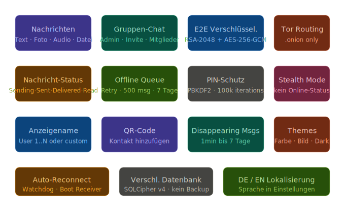
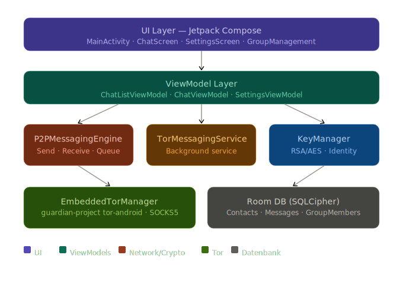

# TorChat for Android



> **P2P encrypted messenger over the Tor network — no servers, no metadata, no IP addresses.**

TorChat is a fully serverless, end-to-end encrypted Android messaging app. Every message travels exclusively through the Tor anonymity network via `.onion` addresses. There are no central servers, no phone numbers, no accounts — just two apps talking directly to each other.

---

## Table of Contents

- [Features](#features)
- [Architecture](#architecture)
- [Cryptography](#cryptography)
- [Protocol](#protocol)
- [Group Chats](#group-chats)
- [Security Model](#security-model)
- [Settings & Privacy](#settings--privacy)
- [Database](#database)
- [Requirements](#requirements)
- [Building](#building)
- [Dependencies](#dependencies)

---

## Features



### Messaging
- **Text messages** with delivery status (Sending → Sent → Delivered → Read)
- **Photos** — sent end-to-end encrypted, up to 5 MB
- **Voice messages** — recorded in-app, played with ExoPlayer, waveform scrubber
- **File transfers** — any file type up to 5 MB, encrypted in transit
- **Message forwarding** — forward to any contact or group
- **Delete for all** — removes message from both sides via `MSG_DELETE` protocol
- **Disappearing messages** — auto-delete after 1 min / 5 min / 1 h / 24 h / 7 days

### Identity
- **Display name** — freely settable (`User 1`, `User 2`, … auto-generated, or custom)
- Display name is transmitted to contacts in every `KEY_EXCHANGE`, `MSG`, and `GROUP_INVITE`
- Contacts automatically receive and store your name when they first hear from you
- **QR code** — share your `.onion` address as a scannable QR code (format: `torchat:<address>`)
- **Manual onion entry** — paste a `.onion` address directly

### Group Chats
- Create groups with name and member selection
- Admin management: add/remove members, promote/demote admins
- Per-member blocking within a group
- Sender name shown above each message in group view
- Group invite delivered via encrypted `GROUP_INVITE` payload
- Offline members receive invite when they come online (queue)

### Privacy & Security
- **PIN lock** — PBKDF2-SHA256 with 100,000 iterations and 32-byte random salt
- **Stealth mode** — does not respond to PING requests (online status hidden from all contacts)
- **No cloud backup** — all SharedPreferences, databases and files excluded from Android backup
- **Notifications disabled when PIN active** — no message previews on the lock screen
- No analytics, no telemetry, no ads

### Offline Resilience
- **MessageQueue** — persists up to 500 outgoing messages for up to 7 days
- Automatically retried when the recipient comes online (PONG → flush queue)
- Per-message retry counter with exponential-style back-off
- `TorWatchdogWorker` (WorkManager, every 15 min) restarts the service if Android kills it
- `BootReceiver` starts the service automatically after reboot or app update

### Appearance
- Dark theme (default) with configurable chat background
- 8 preset background colors
- Custom background from gallery (shown at 35 % opacity)
- Full German / English localization, switchable in settings

---

## Architecture



```
UI Layer (Jetpack Compose)
    MainActivity · ChatScreen · GroupManagementDialog · SettingsScreens
          │
ViewModel Layer
    ChatListViewModel · ChatViewModel · SettingsViewModel
          │
Service Layer
    TorMessagingService  ←→  P2PMessagingEngine  ←→  KeyManager
          │                          │
    EmbeddedTorManager         MessageQueue
    TorProxyManager            ContactPresenceTracker
          │
    Room DB (SQLCipher)
    contacts · messages · group_members
```

### Key Classes

| Class | Responsibility |
|---|---|
| `P2PMessagingEngine` | All P2P logic: send, receive, KEY_EXCHANGE, file transfer, group invite |
| `TorMessagingService` | Android foreground service; owns the engine, queue retry, heartbeat |
| `KeyManager` | RSA-2048 key pair, AES-GCM encryption/decryption, own identity storage |
| `EmbeddedTorManager` | Starts/stops the embedded Tor daemon, exposes the `.onion` address Flow |
| `TorProxyManager` | Opens `Socket` connections through SOCKS5:9050, socket leak protection |
| `ContactPresenceTracker` | PING/PONG presence checks, online status cache |
| `MessageQueue` | SharedPreferences-backed persistent outbox with retry logic |
| `PinManager` | PBKDF2 PIN hashing, check, change, remove |
| `SettingsManager` | Disappearing messages, stealth mode, background, notification prefs |
| `ChatRepository` | Single data access layer over Room DAO for all ViewModels |

---

## Cryptography

### Key Exchange

On first contact, TorChat performs a `KEY_EXCHANGE` handshake:

```
Alice → Bob:  KEY_EXCHANGE { publicKey: RSA-2048 (Base64), onionAddress, displayName }
Bob   → Alice: KEY_EXCHANGE { publicKey: RSA-2048 (Base64), onionAddress, displayName }
```

Both sides store the other's public key in the encrypted Room database.

### Message Encryption

Every message uses **hybrid encryption**:

1. Generate random **AES-256 key** + **96-bit IV**
2. Encrypt message content with **AES/GCM/NoPadding** (128-bit auth tag)
3. Encrypt the AES key with recipient's **RSA/ECB/OAEPWithSHA-256AndMGF1Padding** (BouncyCastle)
4. Sign the ciphertext with sender's RSA private key (`SHA256withRSA`)
5. Transmit: `{ ciphertext, encryptedKey, iv, signature, senderPubKey }`

The sender's public key is always included inline so the recipient can decrypt even before a full KEY_EXCHANGE completes.

### Identity Storage

Keys are stored in **Android Keystore** (where available) or encrypted SharedPreferences. The own `.onion` address is derived from the embedded Tor daemon and cached in the KeyManager.

---

## Protocol



All messages use a JSON wire format over a direct TCP connection to the recipient's `.onion` address:

```json
{
  "version": 1,
  "type": "MSG",
  "senderId": "abc123...onion",
  "recipientId": "xyz789...onion",
  "messageId": "uuid-v4",
  "encryptedPayload": "base64...",
  "signature": "base64...",
  "timestamp": 1710000000000,
  "groupId": "",
  "senderPublicKey": "base64...",
  "senderDisplayName": "Alice"
}
```

### Message Types

| Type | Description |
|---|---|
| `KEY_EXCHANGE` | Mutual public key + display name handshake |
| `MSG` | Encrypted text or group text message |
| `FILE` | Encrypted file/photo/audio (Base64 payload, max 5 MB) |
| `ACK` | Delivery acknowledgment → triggers `DELIVERED` status |
| `PING` | Presence check |
| `PONG` | Presence response → triggers queue flush |
| `MSG_DELETE` | Request recipient to delete a specific message |
| `GROUP_INVITE` | Full group info (name, members, admin flags) sent to each member |
| `ADDRESS_UPDATE` | Notifies contacts when the sender's `.onion` address changes |

### Delivery Flow

```
User sends → P2PMessagingEngine.sendMessage()
  → connect via SOCKS5 to recipient.onion:11009
  → if no public key: KEY_EXCHANGE first (waits for response)
  → if still no key: enqueue in MessageQueue (status: OFFLINE)
  → encrypt with AES-GCM + RSA
  → write JSON to socket
  → read ACK → set status DELIVERED
  → on failure: enqueue, retry when PONG received
```

---

## Group Chats

Groups use a flat fan-out model — there is no group server. The creator sends individual encrypted messages to each member.

### Creating a Group

1. User selects name + members in UI
2. `createGroup()` stores group Contact (isGroup=true) + GroupMember entries in DB
3. `sendGroupInvite()` sends `GROUP_INVITE` to every member
4. Offline members receive the invite when they come online (via MessageQueue)

### Sending in a Group

Each outgoing group message is sent individually and encrypted separately for each member:

```
for member in activeMembers:
    sendGroupMessage(member, text, groupId)
    // stores groupId in TorMessage so recipient shows it in the right chat
```

Status: `DELIVERED` when all members acknowledged, `SENT` when at least one, `FAILED` when none.

### Receiving

The recipient sees `msg.groupId` → looks up the group contact → stores the message under `contactId = groupId`. The sender's onion address is stored in `senderOnion` for name display.

---

## Security Model

| Threat | Mitigation |
|---|---|
| Network eavesdropping | All traffic over Tor `.onion` — no exit nodes, no IP leak |
| Server compromise | No servers exist — fully P2P |
| Message interception | AES-256-GCM + RSA-2048 hybrid encryption |
| Database theft | SQLCipher v4 full-database encryption |
| Device unlock | PIN lock with PBKDF2 (100k iterations, 32-byte salt) |
| Online status leak | Stealth mode — no PONG response |
| Cloud backup | All data excluded from Android Auto Backup |
| Metadata leak | No phone numbers, no email, no user accounts |
| Key impersonation | Public key stored per contact; mismatch detected on mismatch |

### What TorChat Does NOT Protect Against

- A compromised device (malware, physical access with PIN)
- Traffic analysis at the OS level (root/kernel compromise)
- The recipient — once decrypted on their device, they control the message

---

## Settings & Privacy

### General Tab
- **Language** — German / English
- **Security** — PIN setup, change, remove
- **Appearance** — background color or custom image
- **Anonymity** — Tor routing info, key management info
- **App Info** — version, license, diagnostics log

### Network Tab
- Tor connection status + bootstrap progress
- SOCKS5 port display
- New circuit button
- Manual onion address override

### Privacy Tab
- Disappearing messages toggle + duration selector
- Stealth mode toggle (hides online status)
- Push notification toggle (auto-disabled when PIN is active)

### Contacts Tab
- Blocked contacts management
- Unblock action

---

## Database

Room database version **5**, encrypted with SQLCipher v4.

### Schema

**contacts**
```
id TEXT PK, name TEXT, onionAddress TEXT, publicKeyBase64 TEXT,
avatarColor TEXT, isGroup INTEGER, memberCount INTEGER,
addedAt INTEGER, lastSeen INTEGER, isBlocked INTEGER, remoteDisplayName TEXT
```

**messages**
```
id TEXT PK, contactId TEXT FK, content TEXT, encryptedContent TEXT,
isOutgoing INTEGER, timestamp INTEGER, status TEXT, type TEXT,
filePath TEXT, fileSize INTEGER, fileName TEXT, isDeleted INTEGER,
disappearsAt INTEGER, senderOnion TEXT
```

**group_members**
```
id TEXT PK, groupId TEXT FK, contactId TEXT, onionAddress TEXT,
displayName TEXT, isAdmin INTEGER, isBlockedInGroup INTEGER, addedAt INTEGER
```

### Migrations

| Version | Change |
|---|---|
| 1 → 2 | SQLCipher activation (no-op migration) |
| 2 → 3 | Added `group_members` table |
| 3 → 4 | Added `remoteDisplayName` to contacts, `disappearsAt` to messages |
| 4 → 5 | Added `senderOnion` to messages |

---

## Requirements

- Android **8.0 (API 26)** or higher
- ~50 MB free storage (for Tor binary + database)
- Internet connection (for Tor bootstrap, ~30 seconds on first launch)
- Camera / Microphone permissions (optional, for photo/audio messages)
- Storage permission (optional, for sending files from gallery)

---

## Building

```bash
git clone https://github.com/yourname/TorChat.git
cd TorChat
./gradlew assembleDebug
```

The debug APK is at `app/build/outputs/apk/debug/app-debug.apk`.

For a release build, configure a keystore in `app/build.gradle` and run:

```bash
./gradlew assembleRelease
```

---

## Dependencies

| Library | Version | Purpose |
|---|---|---|
| Jetpack Compose | BOM 2024 | UI framework |
| Room | 2.6.x | Local database ORM |
| SQLCipher for Android | 4.5.4 | Database encryption |
| tor-android (GuardianProject) | 0.4.8.17.2 | Embedded Tor daemon |
| jtorctl | 0.4.5.7 | Tor control port |
| BouncyCastle | 1.76 | RSA/AES cryptography |
| Gson | 2.10.1 | JSON serialization |
| OkHttp | 4.12.0 | HTTP (Tor proxy) |
| Coil Compose | 2.5.0 | Image loading |
| ExoPlayer (Media3) | 1.2.0 | Audio playback |
| ZXing | 3.5.2 | QR code generation/scanning |
| WorkManager | 2.9.0 | Background watchdog |
| Coroutines | 1.7.3 | Async/concurrency |

---

## License

MIT License — see `LICENSE` for details.

---

*TorChat does not collect any data. It has no analytics, no crash reporting (unless you enable the in-app diagnostics log), and no network connections other than through Tor.*
